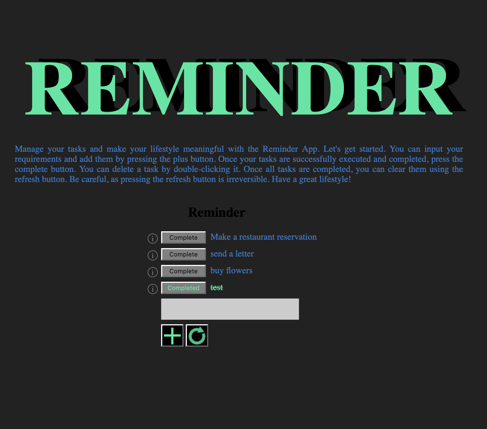
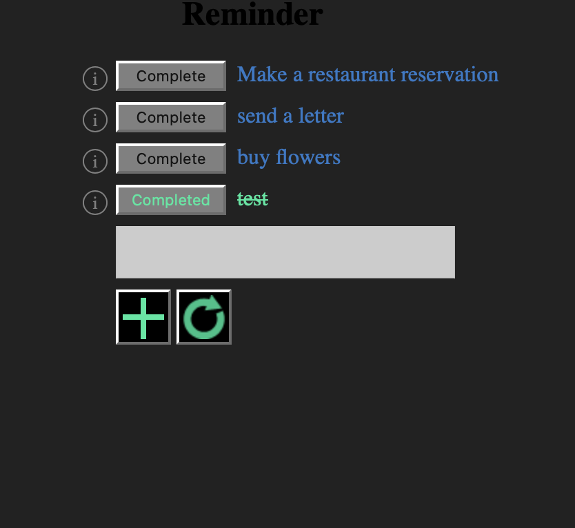
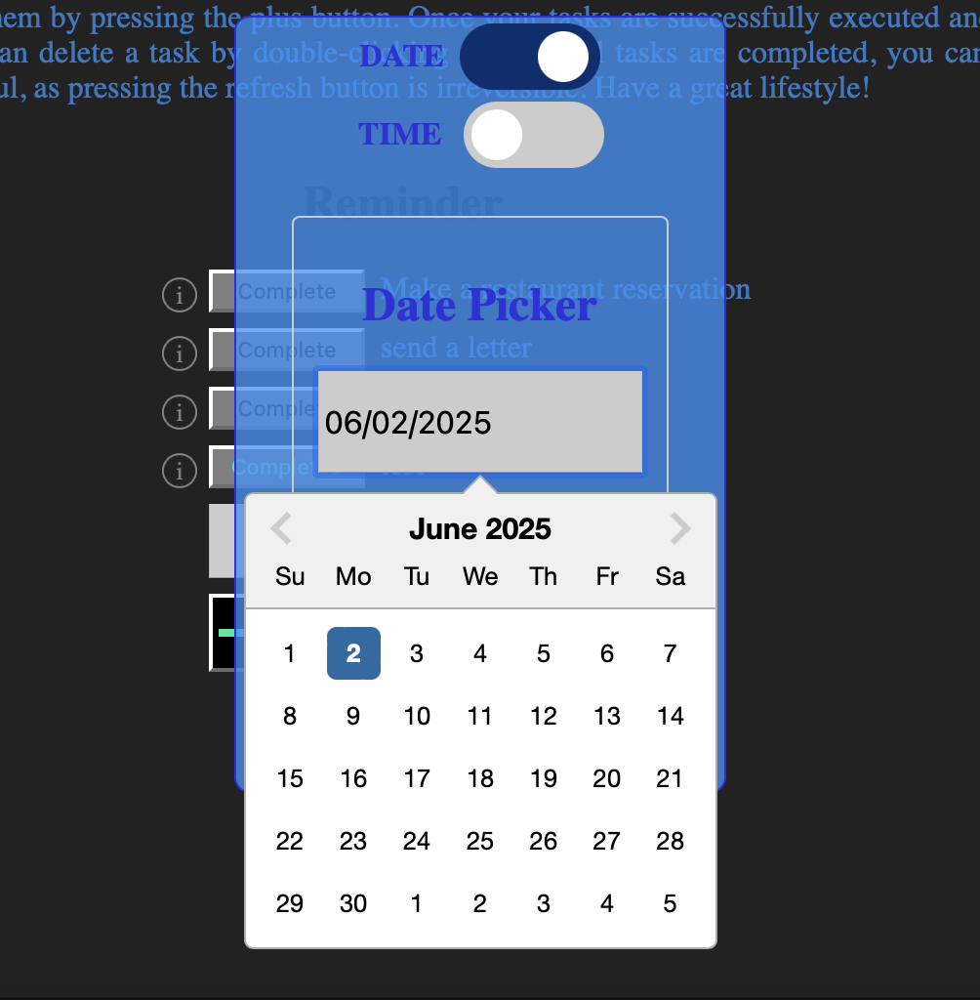
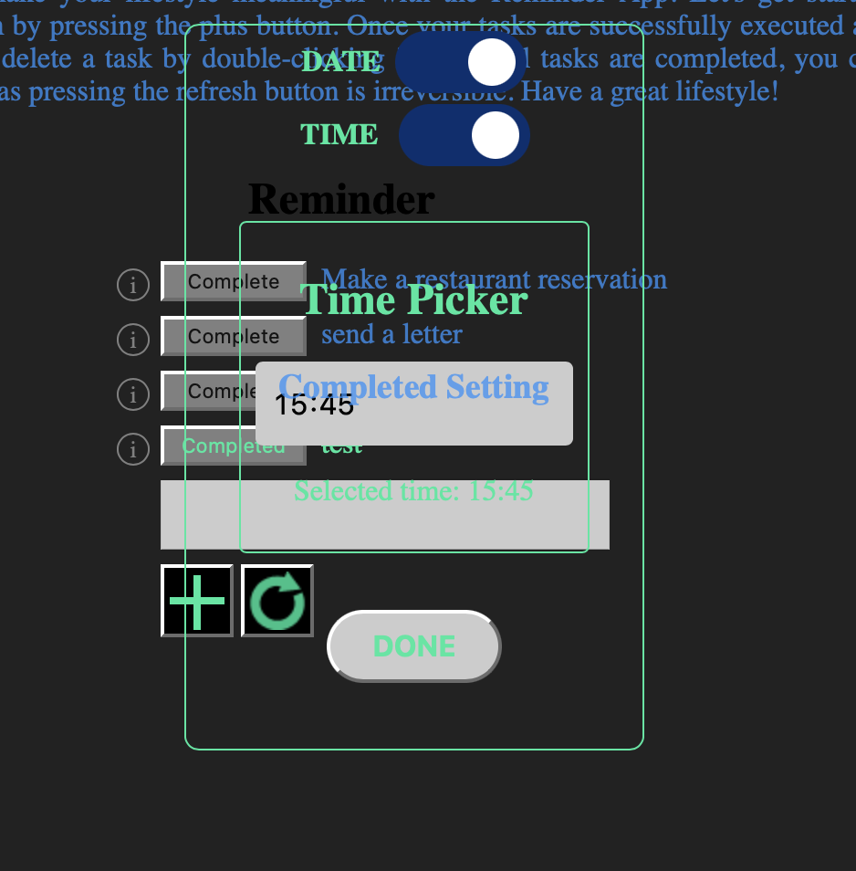

# 📅 Reminder App

> ローカル通知機能付きのReact製 ToDo アプリ  
> 公開中: https://reminder5-27ef0.web.app

## 🔍 概要

Reactライブラリを使用し、ユーザーのタスク管理を支援するToDoアプリを作成しました。  
タイマー設定により、指定した時刻にローカル通知を受け取ることが可能です。

## 🎨 工夫したポイント

- 視認性の高い配色とシンプルなUIで、ユーザーの操作モチベーションを高めるデザインを意識
- 完了済みのタスクは削除ではなく、打消し線で表現することで履歴を残しつつ視覚的に整理
- コストの高いサーバー常時監視ではなく、**ブラウザのローカルストレージとローカル通知機能**を活用して、指定時刻にプッシュ通知を実現

## 🛠️ 使用技術

| 種別           | 技術スタック                            | 選定理由                                                                         |
| -------------- | --------------------------------------- | -------------------------------------------------------------------------------- |
| フレームワーク | React / Vite                            | コンポーネント指向で開発しやすく、Viteにより高速な開発体験を実現                 |
| インフラ       | GCP (Firebase Hosting, Cloud Functions) | サーバーレス構成によりスケーラブルかつ運用コストを抑制できるため                 |
| データベース   | Cloud Firestore                         | リアルタイム同期とスキーマレスな構造がToDoアプリと相性が良いため                 |
| サーバー       | Cloud Functions                         | 必要時にのみ起動する関数型サーバーでコスト最適化が可能なため                     |
| ビルドツール   | Vite                                    | 高速なビルドとHMR（Hot Module Replacement）による効率的な開発環境                |
| Linter         | ESLint                                  | コードの一貫性とバグの早期発見を促進するため                                     |
| フォーマッター | Prettier                                | チームでのフォーマット統一とコードレビュー効率化のため                           |
| E2Eテスト      | Playwright                              | CI環境でも動作しやすく、マルチブラウザ対応の自動テストを実現できるため           |
| CI/CD          | GitHub Actions                          | GitHubと統合しやすく、テスト・デプロイ自動化の導入が容易なため                   |
| コンテナ       | Docker                                  | 本番環境と開発環境の差異をなくすため、再現性と移植性を確保                       |
| エッジサーバー | Cloudflare / Cloudflare Tunnel          | 安全かつ高速なアクセス提供と、開発時のローカル→本番テストの橋渡しに活用          |
| 認証           | Firebase Authentication                 | Googleログインなどを簡単に実装でき、セキュアな認証をサーバーレスで実現可能なため |

## 🧭 アーキテクチャ構成図

- スクリーンショットやGIF（UI紹介）

## Docker Hub

このプロジェクトのDockerイメージは、[Docker Hub](https://hub.docker.com/repositories/henrry301)で公開されています。ここでは、以下の情報を確認できます：

- **リポジトリ名**: `henrry301/reminder`
- **タグ**: `1,2,3,playwright:v1.49.0-jammy` タグを含む各イメージのバージョン。
- **イメージの履歴**: イメージのビルド履歴や変更履歴を確認できます。
- **ダウンロード回数**: このイメージがどれだけダウンロードされたかを確認できます。

Docker Hubを訪れて、プロジェクトに関連するイメージやその詳細を確認してください。

# Create React App でのプロジェクトの始め方

このプロジェクトは [Create React App](https://github.com/facebook/create-react-app) を使って作成されました。

## 利用可能なスクリプト

プロジェクトディレクトリ内で、以下のコマンドを実行できます。

### `npm start`

### `docker-compose up`

### `docker-compose up -d`

コンテナを起動し、E2Eテストまで実行します。

Viteで起動

### `npm run dev`

アプリを開発モードで実行します。\
ブラウザで [http://localhost:3000](http://localhost:3000) を開いて確認してください。

変更を加えるとページがリロードされます。\
コンソールにリントエラーが表示されることがあります。

### `npm test`

インタラクティブなウォッチモードでテストランナーを起動します。\
テストの実行方法についての詳細は、[テストを実行する](https://facebook.github.io/create-react-app/docs/running-tests) セクションを参照してください。

### `npm run build`

アプリを本番用に `build` フォルダにビルドします。\
React を本番モードで正しくバンドルし、最適なパフォーマンスのためにビルドを最適化します。

ビルドはミニファイされ、ファイル名にはハッシュが含まれます。\
アプリはデプロイの準備が整いました！

デプロイに関する詳細は、[デプロイ](https://facebook.github.io/create-react-app/docs/deployment) セクションを参照してください。

### `npm run eject`

**注意: これは一方向の操作です。一度 `eject` すると元に戻すことはできません！**

ビルドツールと構成の選択に満足できない場合、いつでも `eject` できます。このコマンドはプロジェクトから単一のビルド依存関係を削除します。

その代わりに、すべての構成ファイルと遷移依存関係（webpack、Babel、ESLint など）がプロジェクト内にコピーされ、完全に制御できるようになります。 `eject` 以外のすべてのコマンドは機能しますが、コピーされたスクリプトを指し示すので、調整できます。この時点で、あなたは独自のものです。

`eject` を使用する必要はありません。キュレーションされた機能セットは小規模および中規模のデプロイメントに適しており、この機能を使用することを強制されることはありません。ただし、このツールが必要なときにカスタマイズできないのであれば、意味がないことは理解しています。

## 詳細情報

[Create React App のドキュメント](https://facebook.github.io/create-react-app/docs/getting-started)でさらに学ぶことができます。

Reactについて学ぶには、[React のドキュメント](https://reactjs.org/)を参照してください。

### コード分割

このセクションはここに移動しました: [https://facebook.github.io/create-react-app/docs/code-splitting](https://facebook.github.io/create-react-app/docs/code-splitting)

### バンドルサイズの分析

このセクションはここに移動しました: [https://facebook.github.io/create-react-app/docs/analyzing-the-bundle-size](https://facebook.github.io/create-react-app/docs/analyzing-the-bundle-size)

### プログレッシブウェブアプリの作成

このセクションはここに移動しました: [https://facebook.github.io/create-react-app/docs/making-a-progressive-web-app](https://facebook.github.io/create-react-app/docs/making-a-progressive-web-app)

### 高度な構成

このセクションはここに移動しました: [https://facebook.github.io/create-react-app/docs/advanced-configuration](https://facebook.github.io/create-react-app/docs/advanced-configuration)

### デプロイ

このセクションはここに移動しました: [https://facebook.github.io/create-react-app/docs/deployment](https://facebook.github.io/create-react-app/docs/deployment)

### `npm run build` がミニファイに失敗する

このセクションはここに移動しました: [https://facebook.github.io/create-react-app/docs/troubleshooting#npm-run-build-fails-to-minify](https://facebook.github.io/create-react-app/docs/troubleshooting#npm-run-build-fails-to-minify)
